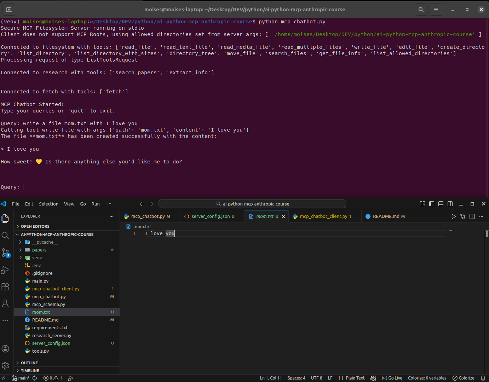

# MCP Anthropic ArXiv Chatbot

Educational project demonstrating how to build a tool-enabled chatbot using the Model Context Protocol (MCP) with Anthropic.

This project follows the course:

👉 https://learn.deeplearning.ai/courses/mcp-build-rich-context-ai-apps-with-anthropic

---

## 🚀 Overview

This chatbot allows users to:

- Search academic papers on arXiv
- Store results locally as JSON (papers ddirectory)
- Retrieve detailed information about specific papers
- Use Claude (LLM) to orchestrate tool execution

---

## Example:
```
--------------------------------------------------------------------------------------------------
Query: search for papers on algebra
--------------------------------------------------------------------------------------------------

Claude: Here is the search for papers on algebra:

 Calling tool search_papers with arg {'topic': 'algebra'}

Claude: The search returned 5 papers related to the topic of algebra. I've stored the paper IDs locally and you can now use the "extract_info" tool to get more details about any of these specific papers.


--------------------------------------------------------------------------------------------------
Query: yes please extract informaticon on the first two you found and summarize them both for me
--------------------------------------------------------------------------------------------------

Claude: Okay, let me first search for some papers on arXiv and then extract information on the top 2 results. 

 Calling tool search_papers with arg {'topic': 'machine learning'}

Claude: Now I will extract information on the top 2 results:

 Calling tool extract_info with arg {'paper_id': '2306.04338v1'}

 Calling tool extract_info with arg {'paper_id': '2006.16189v4'}

Claude: In summary:

Paper 1 (2306.04338v1) discusses the risks and challenges of changing data sources when using machine learning for official statistics. It provides a checklist of common issues and recommended precautions to maintain data integrity, reliability and relevance.

Paper 2 (2006.16189v4) proposes a set of community recommendations for better reporting and validation of supervised machine learning models in biological research. The goal is to help establish standards and better enable reviewers and readers to assess the performance and limitations of ML-based methods.

Both papers highlight important considerations around the use of machine learning, either in the context of official statistics or biological research. They provide practical guidance on ensuring the integrity and transparency of ML-based approaches.
```

## 🧠 Architecture

```
User → Claude (LLM)
          ↓
      Tool Call (MCP)
          ↓
   Python Function (search_papers)
          ↓
   Tool Result → Claude → Final Answer
```

### Flow Example

```
User → Claude
        ↓
   search_papers()
        ↓
   JSON stored locally
        ↓
User asks about specific paper
        ↓
   extract_info()
        ↓
   Claude explains result

```
### After with MCP Server and MCP Client
All this example before is wrapped in MCP Server. After that create a MCP Client to separate logical interface and comunicate to MCP Server.

The client must fetch tool definitions dynamically
```
Claude → tool_use
        ↓
MCP Client
        ↓
MCP Server (stdio)
        ↓
Python function (remote)


```

---

## 🛠️ Tools

### `search_papers`
- Searches arXiv
- Stores results in `papers/<topic>/papers_info.json`

### `extract_info`
- Retrieves paper details by ID
- Reads from local JSON storage

---

## 📁 Project Structure

```
├── main.py
├── tools.py
├── mcp_schema.py
├── papers/
├── .env
└── README.md

``` 

## ⚙️ Setup

### 1. Create virtual environment
```bash
python -m venv venv
or
python3.10 -m venv venv
source venv/bin/activate   # Linux/Mac
venv\Scripts\activate      # Windows
```
### 2. Install dependencies
```
pip install -r requirements.txt

```

### 3. Configure environment
Create .env
```
ANTHROPIC_API_KEY=your_api_key_here
```

# Run
type exit to end the program.
```
python main.py
```


## Run MCP Inspector
```
npx @modelcontextprotocol/inspector python main.py
```

Transport Type
- STDIO
- Command: 
```
uv
``` 
- Arguments
```
run research_server.py
```
or  (python in command and research_server.py in arguments)
```
python 
research_server.py
```
using uv to manager the virtual environment of the project. Us is the modern choice and quickly becoming the new standard in the Python ecosystem.

## Understanding mcp_chatbot.py class MCP_ChatBot
```

     +------------------------------------------------------------+
     | MCP_ChatBot                                                |
     +------------------------------------------------------------+
 (1) | - session: List[ClientSession]                             |
     | - antropic: Anthropic                                      |
 (2) | - available_tools: List[ToolDefinition]                    |
 (3) | - tool_to_session: Dict[str, clientSession]                |
 (4) | - exit_stack: AsyncExitStack                               |
     +------------------------------------------------------------+
     | + int()                                                    |
     | + process_query(query: str)                                |
     | + chat_loop()                                              |
 (5) | + connect_to_server()                                      |
     | + connect_to_server(server_name: str, server_config: dict) |
 (6) | + cleanup()                                                |
     +------------------------------------------------------------+

```
```
class ToolDefinition(TypedDict):
    name: str
    description: str
    input_schemma: dict
``` 

1. Instead of having one session, you now have a list of client sessions where each client session establishes a 1-to-1 connection to each server;
2. available_tools includes the definitions of all the tools exposed by all servers that the chatbot can connect to.
3. tool_to_session maps the tool name to the corresponding client session; in this way, when the LLM decides on a particular tool name, you can map it to the correct client session so you can use that session to send tool_call request to the right MCP server.
4. exit_stack is a context manager that will manage the mcp client objects and their sessions and ensures that they are properly closed. The exit_stack allows you to dynamically add the mcp clients and their sessions as you'll see in th
5. connect_to_servers reads the server configuration file and for each single server, it calls the helper method connect_to_server. In this latter method, an MCP client is created and used to launch the server as a sub-process and then a client session is created to connect to the server and get a description of the list of the tools provided by the server.
6. cleanup is a helper method that ensures all your connections are properly shut down when you're done with them. For all the resources you've added to your exit_stack; it closes (your MCP clients and sessions) in the reverse order they were added - like stacking and unstacking plates. This is particularly important in network programming to avoid resource leaks.


## Connecting multiple MCP servers

```
{
    "mcpServers": {
        
        "filesystem": {
            "command": "npx",
            "args": [
                "-y",
                "@modelcontextprotocol/server-filesystem",
                "."
            ]
        },
        "research": {
            "command": "python",
            "args": ["research_server.py"]
        }                
        ,
        "fetch": {
            "command": "uvx",
            "args": ["mcp-server-fetch"]
        }
    }
}

```
# Example write a file
```
- Secure MCP Filesystem Server running on stdio - ok
- Client does not support MCP Roots, using allowed directories set from server args: [ '/home/moises/Desktop/DEV/python/ai-python-mcp-anthropic-course' ]

Connected to filesystem with tools: ['read_file', 'read_text_file', 'read_media_file', 'read_multiple_files', 'write_file', 'edit_file', 'create_directory', 'list_directory', 'list_directory_with_sizes', 'directory_tree', 'move_file', 'search_files', 'get_file_info', 'list_allowed_directories']
Processing request of type ListToolsRequest

Connected to research with tools: ['search_papers', 'extract_info']
```

Prompt: write a file mom.txt with I love you



Simple fetch example:
Prompt: fetch https://api.github.com/users/torvalds and summarize the response


